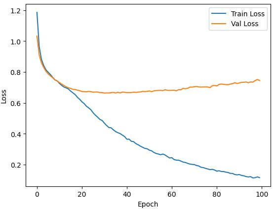
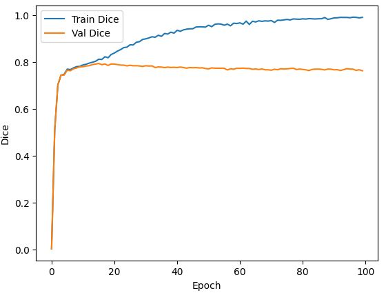

Results of UNET on Monuseg Data: 

So far, the training process of UNET on Monuseg dataset is as follows:
- Learning rate = 1e-4
- Batch size = 8
- Optimizer Adam
- Resizing from (1000x1000) to (256x256)
- Input Image dim : (256, 256, 3)
- Normalization: between 0-1
- Data augmentation : horizontal and vertical flip.
- Loss : ℒ_𝑡𝑜𝑡𝑎𝑙=ℒ_𝐶𝐸+ℒ_𝐷𝐶𝐼𝐸
- K-fold : k = 4
- Eval metric : Dice score

Results using Macenko normalization: 

  
   

