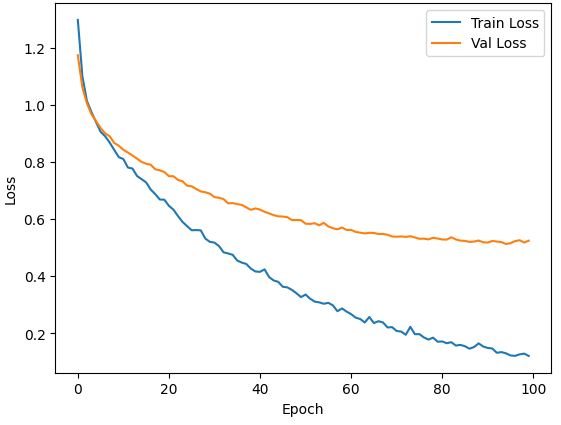
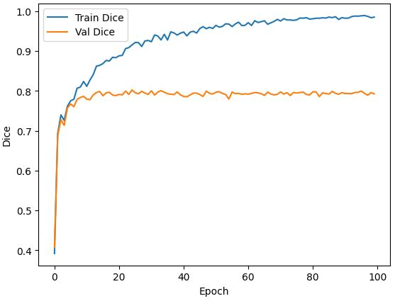

# Results of UNET on TNBC Data: 

## Training Process
So far, the training process of UNET on Monuseg dataset is as follows:
- Learning rate = 1e-4
- Batch size = 8
- Optimizer Adam
- Resizing from (512x512) to (256x256)
- Input Image dim : (256, 256, 3)
- Normalization: between 0-1
- Data augmentation : horizontal and vertical flip.
- Loss : $ℒ_{𝑡𝑜𝑡𝑎𝑙}=ℒ_{𝐶𝐸}+ℒ_{𝐷𝐶𝐼𝐸}$
- K-fold : k = 4
- Eval metric : Dice score

### Results using Macenko normalization: 

  
   

### Results using Reinhard normalization: 

  
   

